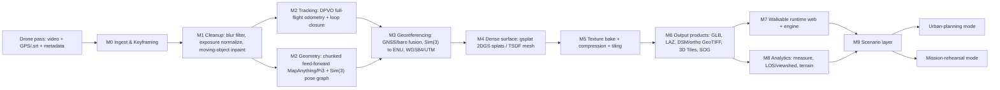

# 02 — System Architecture & Pipeline Design
## Single-Pass Drone Video → Georeferenced, Walkable, Analyzable 3D Scene

| | |
|---|---|
| **Version** | 1.0 |
| **Date** | 2026-08-24 |
| **Component choices** | Justified in `01_Research_and_Technology_Survey.md` |
| **Roadmap & evaluation** | `03_Roadmap_Evaluation_and_Business.md` |

---

## 1. System goals

1. **Input:** one drone pass — video (1080p/4K), GPS track (.srt/XMP), flight metadata (JSON/CSV); optional IMU, barometric altitude, camera intrinsics, RTK/PPK log.
2. **Output products:** georeferenced textured mesh (GLB/OBJ), georeferenced point cloud (LAS/LAZ), splat scene (PLY/SOG/SPZ), GeoTIFF DSM/DTM/orthophoto, Cesium 3D Tiles, metadata/QC report.
3. **Interactive layer:** first-person walkable scene (web + game-engine), measurement/analytics tools, and **scenario configuration** (urban-planning mode; mission-rehearsal mode with injectable entities).
4. **Non-goals for v1:** true real-time onboard processing (target is *near*-real-time offline/edge-batched); sub-centimeter surveying-grade accuracy without RTK; multi-flight fusion (architecture keeps a door open).

## 2. High-level dataflow



ASCII fallback: `video → keyframes(+GPS) → cleanup → {DPVO track ∥ chunked metric geometry} → geo-align → gsplat/TSDF → texture → exports → walkable+analytics+scenarios`.

**Design principles:** every stage is a CLI module with typed intermediate artifacts on disk (resumable pipeline); every GPU-heavy stage has a `--backend local|cloud` switch; every learned component is Apache/BSD/MIT licensed so the whole product stays shippable, including defense scope.

---

## 3. Module specifications

### M0 — Ingest & Keyframing
- **Inputs:** `.mp4/.mov` (+ matching `.srt` GPS subtitle), flight manifest JSON. Validate with ffprobe.
- **Process:**
  - Decode with ffmpeg; compute per-frame sharpness (variance-of-Laplacian) and exposure histogram; drop blurred/blown frames.
  - Adaptive keyframe selection: target ~0.5–1 fps equivalent (VGGT-Long guidance), minimum inter-frame GPS displacement threshold, sharpness ranking within sliding windows.
  - Parse per-keyframe `lat, lon, alt_abs, alt_rel, gimbal pitch/yaw, ISO/shutter, timecode` from XMP/SRT (exiftool on extracted JPEGs or direct MP4 atom parse). Store as `keyframes.jsonl`.
- **Outputs:** `frames/*.jpg`, `keyframes.jsonl`, QC plots (blur score, GPS path preview).
- **Failure modes:** missing .srt → fall back to EXIF-only (lower georef accuracy, warn); variable frame rate → re-time by PTS.

### M1 — Cleanup & moving-object suppression *(optional stage)*
- **Blur/compression mitigation:** prefer sharpness filtering at M0 over deblurring; keep original bitrate advice for capture ops (Doc 3 §7 capture guidance).
- **Exposure normalization:** CLAHE-lite / gray-world white balance per chunk to stabilize splat training across illumination changes.
- **Dynamic objects (vehicles/pedestrians/animals):**
  - Detect + segment per keyframe: YOLO-class detector for common categories, **Grounded-SAM/SAM2** masks for open-vocabulary classes.
  - Inpaint masked regions: **LaMa** per-frame; **ProPainter** when temporal consistency matters (keyframe neighborhoods).
  - Rationale: feed-forward geometry assumes static scenes; unmasked movers become floaters/ghost trails in both point maps and splats.
- **Config:** `--mask-model`, `--inpaint {off,lama,propainter}`; off by default for fast passes.

### M2 — Geometry core (two cooperating tracks)
**Track A — full-flight tracking (cheap, real-time):**
- **DPVO/DPV-SLAM** (MIT) over the keyframe stream at moderate resolution → continuous trajectory + loop closure via its DBoW2 backend. Purpose: backbone poses for long flights where transformer chunks would drift; runs comfortably on small GPUs.

**Track B — dense metric geometry (the heavy lifter):**
- Chunk the sequence into overlapping windows (e.g., 24–48 frames, 50% overlap; window size auto-set by available VRAM).
- Per chunk run a feed-forward metric model — primary: **MapAnything-apache** (accepts our intrinsics + optional GNSS ray hints; outputs metric depth/point maps, poses, confidence); defense-scope alternate: **Pi3** (BSD); civilian research demo alternate: VGGT-1B-Commercial.
- Align chunks with a **Sim(3)/SE(3) pose graph**: overlap-region pointmap registration (RANSAC + ICP refine) for relative edges; DPVO trajectory and GNSS positions as absolute anchors; solve with GTSAM/Ceres; detect and close loops via place-recognition (DBoW-style) — the proven **VGGT-Long pattern**, using its repo as reference implementation.
- Confidence-weighted fusion of per-chunk depth maps into a global scaled depth set aligned to Track A's trajectory.

### M3 — Georeferencing & metric scale
- Build local ENU frame from the reconstruction. Estimate robust **Sim(3)** transform mapping camera centers → their GNSS positions (Huber/RANSAC to reject GPS outliers; standalone-GNSS outliers of several meters are expected).
- Vertical channel: barometric altitude provides high-rate *relative* height — fit its offset/scale to GNSS altitude to stabilize vertical shape between GNSS fixes.
- Metric cross-check: compare GNSS-derived baseline distances against model-space distances; against metric-head predictions (MapAnything/DA3-METRIC). Discrepancy > threshold → flag in QC report rather than silently picking one.
- Coordinate conversion: **pyproj/PROJ** — WGS84 ↔ UTM zone ↔ ECEF ↔ ENU. All products stamped with EPSG codes + accuracy metadata.
- Optional IMU: loosely-coupled factor graph (GTSAM): GNSS factors + baro factors + vision-pose factors; smoothing window over the flight.
- Expected accuracy without GCPs (from Doc 1 §5): standalone GNSS ≈ 1–3 m horizontal / worse vertical; RTK/PPK ≈ cm-level. One surveyed checkpoint recommended for QA.

### M4 — Dense surface reconstruction
- **Primary — Gaussian splats via gsplat (Apache):** train `splatfacto` (visual quality) and/or the **2DGS surfel trainer** (accurate surfaces) on keyframes + refined poses + intrinsics. Anti-aliasing on; MCMC densification for large outdoor scenes; multi-GPU/cloud backend for big areas. Typical quality on 24 GB GPUs in ~15–60 min for large drone captures.
- **Mesh extraction:** from 2DGS surfel depth renders → TSDF integration (Open3D, MIT, fixed voxel size in meters post-scaling) → marching cubes → **measurable mesh**. Alternative pure-depth route: fuse scaled depth maps directly to TSDF (faster, less photorealistic textures handled at M5).
- **Cleanup:** statistical outlier removal, floater pruning (SuperSplat-class tooling or scripted), hole filling (Poisson where needed), largest-component retention per semantic region.
- **Semantic layer (v1.5):** lightweight segmentation lift (sky/building/road/vegetation/water) onto mesh faces + splat attributes — powers scenario rules and analytics filters.

### M5 — Texturing, compression, tiling
- Texture bake: project best-view keyframes onto mesh (visibility-aware, Poisson-blended seams); sRGB-consistent.
- Runtime variants: decimated GLB (Draco/meshopt) for engine + web; splat scene compressed to **SOG/SPZ** for splat-native viewers; Cesium **3D Tiles** tileset (py3dtiles / Cesium ion-compatible layout) for globe-scale streaming; LAS/LAZ via PDAL; GeoTIFF DSM/DTM/orthophoto rendered by orthographic splat/mesh projection.
- Every artifact ships with a JSON sidecar: CRS, accuracy estimates, source flight IDs, processing config hash (provenance chain).

### M6 — Output package (contract)

```
output/<job_id>/
├── mesh/model_geo.glb            # textured, georeferenced (WGS84/UTM)
├── mesh/model_geo.obj + .mtl     # GIS interchange
├── cloud/georeferenced.laz       # PDAL-generated
├── raster/dsm.tif dtm.tif orthophoto.tif
├── tiles/3dtiles/tileset.json    # Cesium streaming
├── splats/scene.sog|.spz scene.ply
├── walkable/
│   ├── collision.glb             # simplified mesh for physics
│   ├── navmesh.bin               # Recast/Unity NavMesh asset source
│   └── scene_config.json         # spawn points, bounds, POIs
├── analytics/dsm_analytics.tif   # slope/aspect/viewshed-ready stack
└── qc/report.html + provenance.json
```

### M7 — Walkable runtime
Two frontends, one asset contract (`walkable/*`):
- **Web (fast share/review):** three.js + **spark** renderer (MIT) for splats + GLB collision; FPS/WASD controller with gravity; ground clamping via collision mesh; **auto-navmesh inspired by splatwalk's FastNav** (floor-field extraction → Recast) enabling click-to-move and later AI agents.
- **Engine (full experience):** Godot 4 (MIT splat plugin, CharacterBody3D, NavigationRegion3D) or Unity (aras-p MIT plugin, CharacterController, Unity NavMesh) — chosen engine gets collision meshes + navmesh baked by M6; splat renderer for visuals with mesh LOD fallback at distance.
- Player capabilities v1: walk/run/jump, teleport-to-POI, minimap (orthophoto), coordinate readout (live lat/lon/alt from inverse georef), photo-mode.
- AI agents (mission mode): NavMesh-driven entity movement; see M9.

### M8 — Analytics layer
- **Measurement:** point-to-point distance, polyline, polygon area, cut/fill volume vs arbitrary base plane or DTM; profile/elevation along path. Implemented on the georeferenced mesh/DSM server-side, mirrored client-side for quick looks.
- **Line-of-sight & viewshed:** ray tests on DSM/mesh between observer/target points; cumulative viewshed from observer sets (watchtower coverage, surveillance planning, "can this street be seen from here?").
- **Terrain derivatives:** slope, aspect, roughness, drainage hints from DSM/DTM (GDAL/WhiteboxTools algorithms reimplemented or wrapped).
- **Facade inspection mode:** click facade → unwrap texture region, annotate defects, export marked-up report (PDF/GeoJSON).
- **Comparison jobs:** two-date change detection via CloudCompare-class M3C2 distance between clouds (construction monitoring, damage assessment).

### M9 — Scenario configuration layer (core pillar)
Scenario = versioned config (YAML/JSON) applied over the same reconstructed scene:

```yaml
scenario:
  name: "sector7_rehearsal_v3"
  mode: mission_rehearsal        # or: urban_planning | inspection | free
  environment:
    time_of_day: 16:30           # relighting of splat scene (exposure/tonemap approx)
    weather: dust_haze           # visual FX only in v1
  entities:
    - {type: patrol_foot_soldier, path: navmesh_random, count: 4}
    - {type: technical_vehicle,   path: road_graph, count: 1}
  threat_rules:
    visibility_model: dsm_los    # uses M8 viewshed
    detection_range_m: 350
  objectives:
    - {id: exfil_north, kind: reach_zone, zone: [lon,lat,radius]}
  overlays: [threat_rings, cover_map, comms_shadow]
```

- **Urban-planning mode:** zoning/parcel overlays, shadow & viewshed studies (built on M8), sightline preservation checks, stakeholder walk-through links (web frontend share URLs), annotation threads pinned to world coordinates.
- **Mission-rehearsal mode:** inject configurable entity templates (patrols on NavMesh, vehicles on extracted road graph), threat rings computed from DSM line-of-sight, cover/concealment map, objective zones, after-action replay of player paths. Framed as a **planning/training sandbox built on standard GIS LOS analysis + game-dev NavMesh AI**; v1 contains no ballistics simulation — entity templates carry behavior/threat parameters only. Compliance note: components selected (BSD/Apache/MIT) keep this scope license-clean; VGGT-family weights are excluded here (AUP bars military use).
- **Config UI:** editor panel listing layers/entities with drag-drop POIs; scenarios export/import as single file → shareable briefings.

### M10 — Orchestration & operations
- Single entrypoint `pipeline run job.yaml`; stages cached/resumable (artifact hashes); structured logs + per-stage timings feeding the QC dashboard.
- GPU backend abstraction: `local` (your 3050) / `cloud` (4090/A100 rental APIs) selected per stage via config — e.g., geometry+splat on cloud, everything else local.
- Containerized deps (CUDA/PyTorch/ffmpeg/PDAL/GDAL); model weights fetched by pinned versions with license-flag verification at install time (hard-fail if a non-approved weight is configured for defense builds).

---

## 4. Challenge → mitigation matrix (maps to problem statement)

| # | Challenge | Mitigations |
|---|---|---|
| i | Limited viewing angles (single pass) | Oblique gimbal capture guidance; splats render plausibly from sparse views vs MVS holes; explicit occlusion reporting in QC; Poisson/hole-fill for closed meshes; expectations set per surface class (facades good if oblique, undersides never) |
| ii | Motion blur & compression artifacts | Sharpness-scored keyframe selection; advise high-bitrate/all-I-frame capture; blur-aware frame rejection; robust confidence weighting in pose-graph and splat training |
| iii | Variable illumination & shadows | Exposure normalization (M1); confidence-weighted splat optimization; capture guidance (lock exposure, midday-or-overcast windows); relighting approximation in scenario layer |
| iv | Dynamic objects | Detection (YOLO/Grounded-SAM/SAM2) + inpainting (LaMa/ProPainter) before geometry; residual ghost cleanup pass; QC flags for high-motion segments |
| v | GPS noise & sensor drift | Robust Sim(3) alignment with outlier rejection; baro-relative vertical fusion; DPVO loop closure limits visual drift; metric cross-checks (GNSS baselines vs metric-head); RTK/PPK path when available; honest error bars in QC |
| vi | Near-real-time requirement | Feed-forward chunks (seconds each) instead of overnight SfM; staged products (fast coarse mesh in minutes, splat-refined product after); cloud burst parallelization; roadmap item: incremental/streaming variant (DA3-Streaming-class windows + online splat refinement) |
| vii | Occluded surfaces | Documented single-pass limits; gimbal angle strategy; semantic hole-filling; scenario layer marks "no-data" volumes instead of hallucinating |
| viii | Metric accuracy w/o GCPs | Direct georeferencing stack (M3): RTK/PPK ≈ cm-level, standalone GNSS ≈ meters (documented per job); optional single checkpoint QA; provenance + accuracy sidecars on all products |

---

## 5. Hardware profiles & scaling

| Profile | Hardware | Runs locally | Offloaded | Target latency (10-min 4K pass) |
|---|---|---|---|---|
| A — Dev (yours today) | RTX 3050 6 GB | ingest/keyframes, GPS parse, masking (small models), DPVO tracking (reduced res), analytics UI, web viewer | chunked metric geometry (low-res smoke-tests only), splat training, texture baking | Coarse product < 1 hr incl. cloud round-trip |
| B — Workstation | 24 GB (RTX 4090/3090) | everything | nothing | Full product in ~1–3 hr; coarse in ~15–25 min |
| C — Cloud batch | A100/H100 ×N | orchestration only | all GPU stages, parallelized per chunk | Full product ~20–45 min wall-clock; near-real-time goal |
| D — Edge (stretch) | Jetson Orin 64GB | DA3-Streaming-class inference, incremental splat updates, viewer | none (accept lower fidelity) | Continuous onboard mapping research track |

Scaling levers: chunk-parallelism (embarrassingly parallel per window), resolution tiers (coarse/fine products), splat-training memory savings in gsplat, compressed interchange formats (SOG/SPZ, Draco) so even Profile A can author & review.

## 6. Security, compliance & licensing posture
- **License-clean core:** Apache/BSD/MIT everywhere in shipped codepaths; install-time weight-license verifier; AGPL components (ODM) used only as internal benchmark, never linked into the product.
- **Defense scope:** BSD/Apache models only (MapAnything-apache / Pi3 / DA3-metric / DPVO); VGGT-family excluded by AUP; no export-controlled dependencies in core.
- Data handling: jobs are self-contained folders (easy air-gapped deployment); no telemetry in v1; scenario files may be classified — treat as user data, never leave the deployment unless exported.

## 7. Capture guidance (feeds back to flight ops)
Single pass quality ceiling is set at capture time: fly ~70–80% forward overlap equivalent (speed vs fps), gimbal −30°…−45° oblique mixed with nadir segments for facades+terrain, lock exposure, highest bitrate/all-I encoding, RTK/PPK when possible, log .srt/XMP, avoid low-sun shadows when urban canyons matter, one slow circle around priority structures if mission permits (still "single launch").
