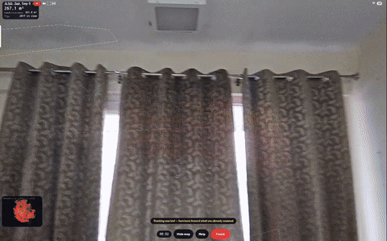
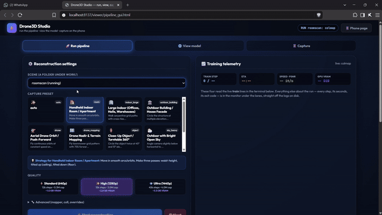
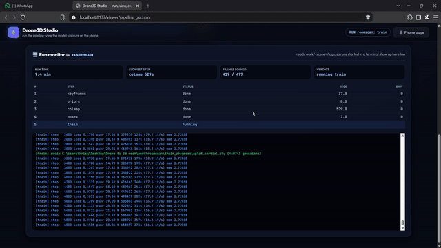
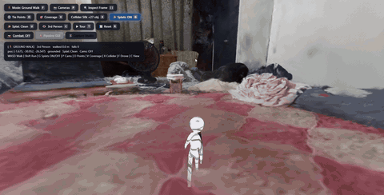
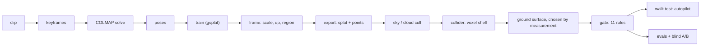
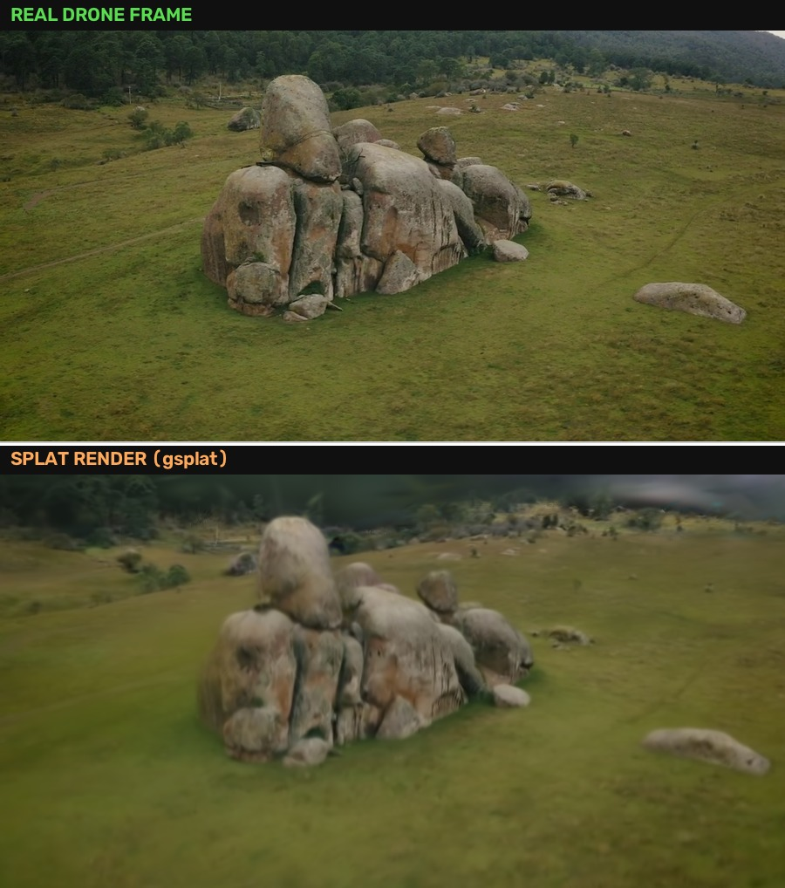
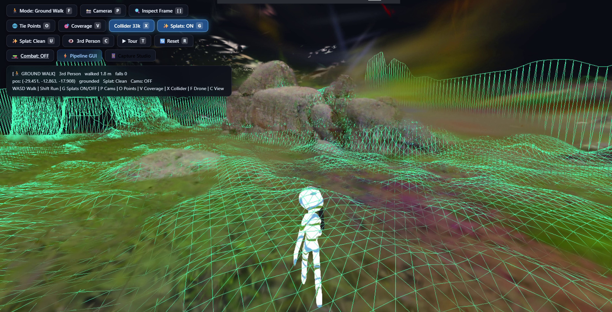

<h1 align="center">Drone / Phone Video → Walkable 3D World</h1>

<p align="center">
  <b>Point a drone or a phone at a place. Get back a world you can walk through in a
  browser — with a floor that holds you, walls that stop you, and machine-verified
  proof that a character can actually get from A to B.</b>
</p>

<p align="center">
  <a href="https://www.youtube.com/watch?v=xMRw3slJjIo" title="Watch the 4:30 demo on YouTube">
    
  </a>
</p>

<p align="center">
  <b>▶ <a href="https://www.youtube.com/watch?v=xMRw3slJjIo">Watch the 4:30 demo on YouTube</a></b>
  · <a href="docs/media/demo-4m30s.mp4">same cut, hosted in this repo (23&nbsp;MB)</a>
  · <a href="#proof-not-promises">skip to the measured results</a>
</p>

<p align="center">
  <a href="https://github.com/krisgarg25/Drone_Phone_video_to_playable_3d_world/actions/workflows/ci.yml"></a>
  <a href="LICENSE"></a>
  
  
  
  
</p>

<p align="center">
  <sub>Topics: <code>3d-gaussian-splatting</code> · <code>colmap</code> · <code>photogrammetry</code> ·
  <code>digital-twin</code> · <code>playcanvas</code> · <code>webgl</code> · <code>drone</code> ·
  <code>computer-vision</code> · <code>game-physics</code> · <code>arcore</code></sub>
</p>

<p align="center">
  <a href="#demo-video-430"><b>Watch</b></a> ·
  <a href="#real-footage-not-renders">Footage</a> ·
  <a href="#how-a-video-becomes-a-world">Pipeline</a> ·
  <a href="#record-on-your-phone">Capture</a> ·
  <a href="#install">Install</a> ·
  <a href="#proof-not-promises">Proof</a> ·
  <a href="#failure-policy">Failure policy</a> ·
  <a href="#troubleshooting">Troubleshooting</a>
</p>

Most 3D-from-video pipelines chase a nicer render. This one chases a **place**.
A splat cloud that looks perfect but has no floor, no scale, and no way in or out
is a screensaver. The unsolved part — and where all the engineering here lives —
is turning a reconstruction into something a person can stand in and walk across.

| | |
|---|---|
| **Input** | one `.mp4` (drone orbit, walked phone scan, handheld clip) or a folder of frames, optionally with recorded AR poses |
| **Output** | `work/<name>/viewer_assets/` — splat, collision mesh, heightfield, ground colours, generated tour route — served by a PlayCanvas viewer with a third-person character |
| **Verification** | an autopilot walk test that drives the character headless and logs a sampled trajectory, an 11-rule world gate, and blind A/B evidence against the real footage |
| **Manual tuning** | none. `--preset auto` diagnoses the footage, and every budget comes from the scene or the GPU |

---

## Demo video (4:30)

The full walkthrough — capture on the phone, reconstruction, walkable result — is
one 4 minute 30 second cut, available three ways (it is the same video everywhere):

| where | link | notes |
|---|---|---|
| **YouTube (best way to watch)** | **[youtube.com/watch?v=xMRw3slJjIo](https://www.youtube.com/watch?v=xMRw3slJjIo)** | streams instantly, click the poster above |
| **In this repo** | [`docs/media/demo-4m30s.mp4`](docs/media/demo-4m30s.mp4) | 540p, 23 MB — compressed under GitHub's 25 MB file limit; open the file page and it plays in the browser |
| **Direct stream** | `https://cdn.jsdelivr.net/gh/krisgarg25/Drone_Phone_video_to_playable_3d_world@main/docs/media/demo-4m30s.mp4` | range-request friendly, paste into any player |

> GitHub strips `<video>` tags from READMEs, so no `.mp4` can play *inline* on
> this page — that is why the moving pictures below are GIFs cut from real
> screen recordings, and why the poster above links out to YouTube. The in-repo
> cut is two-pass encoded to sit under GitHub's 25 MB file limit and muxed
> faststart, so it starts playing before it finishes downloading.

---

## Real footage, not renders

Everything below is cut from actual screen recordings of the real app — the phone
capture page, the pipeline monitor, the training run, the walk test. No AI clips.

### 1 · Scan the room with your phone

<p align="center">
  
</p>

<p align="center"><sub>Live scan: coverage readout, needs-angles cue, and the inset map filling in as you walk. Recorded on a real phone, straight off the capture page.</sub></p>

### 2 · Run the reconstruction

<p align="center">
  
</p>

<p align="center"><sub>Drone3D Studio: pick the scene, the capture preset and the quality tier, hit Start reconstruction. The same run can be driven from the terminal.</sub></p>

### 3 · Watch it train, live

<p align="center">
  
</p>

<p align="center"><sub>The run monitor reads <code>work/&lt;scene&gt;/logs</code>, so terminal runs show up here too — keyframes, COLMAP solve counts, training loss and gaussian counts as they happen.</sub></p>

### 4 · Walk the result

<p align="center">
  <a href="docs/media/walk-rocks-hd.mp4" title="Open the 1918×976 source clip">
    
  </a>
</p>

<p align="center"><sub>Twelve seconds of ground walk inside a room rebuilt from one phone scan — collider shell on, no hand-tuned settings, and that HUD line is the harness's own telemetry, not a caption. Click for the 1918×976 source clip.</sub></p>

---

## How a video becomes a world



| stage | what it decides |
|---|---|
| **keyframes → COLMAP** | where every camera was. Flag support is probed from the vendored binary, not assumed; a failing solve walks a rescue ladder (other matcher, other mapper, relaxed thresholds), and a legacy vocab tree is reported as an unsupported asset instead of a crash |
| **train** | the splat, at a budget derived from free VRAM, checkpointing `splat.partial.ply` so a Windows-level kill that no `except` can catch is still rescuable |
| **frame** | the hardest step: which way is up, what a metre is, how much of the scene is a boundable room. Thin multi-view support degrades to bounding the region by the flight path and the ground under it — with a warning, not a failed run |
| **export → sky/clouds** | viewer assets; fog flown above a cloud layer reconstructs as ~30% of the scene and is cut on painted-area fraction, not a colour guess |
| **collider → surface** | the physics shell, then a *choice*: two candidate grounds are built (clipped shell vs heightfield), both are routed, and whichever the autopilot walks further on ships — so physics mesh, route and browser underlay cannot disagree |
| **gate** | 11 severity-tiered rules. Hard ones (no measured ground, inverted floor, spawn in mid-air) name themselves and are **never** downgraded to make a run green |
| **walk test** | drives the character headless through the real build, logging position, grounding and falls every 0.5 s |

Four problems shaped this design:

1. **A reconstruction has no metre.** SfM recovers a scene up to an unknown
   scale. The pipeline measures it from physics: a drone flies ~5 m/s, a walked
   phone sits ~1.6 m above the ground (`--speed-anchor`, `--height-anchor`).
2. **Splats are not surfaces.** A Gaussian cloud has no floor. The collider is a
   voxelised shell in which every height change is a vertical wall — a 0.34 m
   capsule cannot climb a 0.35 m riser at all. Walkability becomes a routing
   question about the body that will walk it.
3. **The truth depends on the machine.** Training sizes its budget from VRAM
   free *at that moment*, so the same clip yields 7.5k or 30k splats. Every
   downstream threshold is relative (share of cloud, spread across the camera
   path, the scene's own footprint).
4. **A number can be right and the claim wrong.** `walked 22 m, falls 0` sounds
   fine while the character floats — so telemetry logs a sampled route and the
   runner cross-checks it against the distance claimed.

---

## Record on your phone

You need one thing: a slow walk with a phone. AR pose logging is optional but
helps a lot indoors. Full detail lives in [`docs/PHONE_CAPTURE.md`](docs/PHONE_CAPTURE.md).

**Step 1 — open the capture page on your phone.**

```bat
.venv\Scripts\python.exe _serve.py 8137 .
```

Open the HTTPS address it prints on the phone → `viewer/capture.html` →
**Start scan**. Grant the camera permission. Recording starts when you tap
**Start recording** — never before, so no untracked pre-roll poisons the solve.

**Step 2 — walk it right.** This matters more than any setting:

- **Arcs and orbits, never spins.** Every rotation should ride on a sideways
  step. Standing still and panning is the one move that actively poisons the solve.
- **Three height passes:** waist, above head, knee height.
- **Slow and steady**, good light, 60–70%+ overlap between views.
- **Corners get extra orbit shots** — half a circle around each corner.
- **One hold per room** (all vertical or all horizontal), 1.5–4 minutes per room.

**Step 3 — get the files to the laptop.** The take transfers as video plus an
AR pose log and a calibration file. Drop them next to each other:

```
videos/myscene/walk1.mp4
videos/myscene/walk1_poses.jsonl
videos/myscene/walk1_calibration.json
```

No AR phone? Record plain video with any camera app — the movement rules above
still carry the solve. iPhone users can also log poses with Record3D; any
ARCore logger app works on Android (see `docs/PHONE_CAPTURE.md` for formats).

**Step 4 — run it.**

```bat
.venv\Scripts\python pipeline.py run myscene            REM auto preset, full quality
.venv\Scripts\python pipeline.py run myscene --quality smoke   REM every step, in minutes
.venv\Scripts\python pipeline.py view myscene           REM serve + open the walkable viewer
```

---

## Proof, not promises

Measured on a 6 GB RTX 3050, every take in `videos/`, `--quality smoke` — a real
300-step train, because skipping `train` leaves most of the graph unexercised
and the run passes vacuously:

| take | capture | status | steps | walked | sampled route | airborne | falls |
|---|---|---|---|---|---|---|---|
| rocks | drone orbit | complete | 17/17 | 65.2 m | 64.7 m | 5/61 | 0 |
| temple | drone, cloud sea | partial | 17/17 | 65.2 m | 64.0 m | 0/61 | 0 |
| room_w_jsonl | phone + AR poses | complete | 15/15 | 36.5 m | 31.7 m | 1/334 | 0 |
| roomscan | phone scan | complete | 15/15 | 17.1 m | 15.5 m | 0/331 | 0 |
| test1 | phone | complete | 15/15 | 28.0 m | 26.2 m | 0/332 | 0 |
| test2train | phone | complete | 15/15 | 28.1 m | 26.4 m | 0/336 | 0 |
| test2horizontal | phone, low texture | partial | 15/15 | 30.1 m | 28.0 m | 0/336 | 0 |

`partial` means the world shipped **and** the gate then refused to certify it:
temple and test2horizontal fail the hard rule *spawn on supported ground*. One
line says so instead of quietly passing a world the pipeline does not trust.

Reproduce it:

```bash
.venv\Scripts\python tests\check_all.py    # fast suites, seconds — this is what CI runs
.venv\Scripts\python tests\test_e2e.py     # every take in videos/, ~30 min
```

Top is the real drone frame, bottom is the splat rendered from the same camera —
blinded A/B stacks, order kept in a separate key (`results/pair_key_<take>.json`):



Mid-walk, from inside the same world (HUD line is live telemetry, not a caption):



## Install

Clean clone to first walk in five steps. Everything is Windows-native — no WSL,
no container, no installer wizard.

### 0 · Prerequisites

| need | why | check |
|---|---|---|
| **Windows 10/11** | COLMAP and ffmpeg ship as vendored `.exe` | — |
| **NVIDIA GPU**, driver new enough for CUDA 12.4 | `train` is not optional and gsplat has no CPU path | `nvidia-smi` |
| **Python 3.12** and **3.10** | pipeline and training live in separate envs; bootstrap locates both via the `py` launcher or `PATH` | `py -0p` |
| **Node 18+** | the collision mesh is built by `@playcanvas/splat-transform` | `node -v` |
| **git + git-lfs** | one 313 MB COLMAP CUDA provider lives in LFS | `git lfs version` |
| **~4 GB disk**, + ~1 GB per take while it works | two environments plus working files | — |

### 1 · Clone

```bash
git clone https://github.com/krisgarg25/Drone_Phone_video_to_playable_3d_world.git
cd Drone_Phone_video_to_playable_3d_world
git lfs pull
```

`git lfs pull` is the step people skip and regret: without it the 313 MB CUDA
provider is a 130-byte text pointer, and COLMAP dies with a crash that never
mentions the real cause.

### 2 · Bootstrap both environments

```bash
python scripts/bootstrap.py --with-train
```

One command, four jobs: create `.venv` (3.12, pipeline) and `.venv310`
(3.10, CUDA training) from the pinned requirements; install the Node tools
under `tools/`; download the Chromium the headless walk test drives; then hand
off to `pipeline.py doctor`. Drop `--with-train` for a pipeline-only
environment, or run `--check` to change nothing and just list what is missing.

### 3 · Verify the toolchain

```bash
.venv\Scripts\python.exe pipeline.py doctor
```

`doctor` probes every COLMAP subcommand, checks `pycolmap` against the vendored
COLMAP, confirms the training env can see the GPU, and prints a copy-pasteable
`fix:` line for anything it rejects. Green here means the next failure cannot
be an environmental one.

### 4 · First run

```bat
.venv\Scripts\python.exe pipeline.py run room_w_jsonl --quality smoke   REM every step, in minutes
.venv\Scripts\python.exe pipeline.py view room_w_jsonl                  REM serve + open the walkable viewer
```

`smoke` exercises the whole graph with a real 300-step train, because skipping
`train` passes vacuously. Then point `videos/<name>/` at your own footage
([Record on your phone](#record-on-your-phone)) and run without `--quality`
for the full budget.

### 5 · Drive the viewer

The walker is a third-person character on the reconstructed physics shell.
Everything is a hotkey, and the HUD line repeats the useful ones:

| key | action | key | action |
|---|---|---|---|
| `W A S D` / `Shift` | walk / run | `F` | drone ↔ ground-walk mode |
| `C` | 1st ↔ 3rd person | `T` | autoplay the generated tour |
| `G` | splats on/off | `U` | splat clean |
| `X` | collider wireframe | `V` | coverage overlay |
| `P` | COLMAP cameras | `O` | tie points |
| `I` | inspect a source frame | `R` | reset to spawn |

### Every command

| command | what it does |
|---|---|
| `run <scene>` | the full step graph; `--preset auto` diagnoses the footage, `--quality smoke` shrinks it to minutes |
| `view <scene>` | serve `viewer_assets/` and open the walkable viewer |
| `scan <video>` | diagnose footage before burning GPU hours |
| `ui` | the browser dashboard: run monitor, live logs, phone upload |
| `status` · `coverage` · `benchmark` | where a run stands · what the cameras saw · what this GPU can hold |
| `capture` | what to film for a given preset |
| `doctor` | toolchain health, with a `fix:` per rejection |

### Manual setup (if you would rather not run bootstrap)

```bat
py -3.12 -m venv .venv
.venv\Scripts\python.exe -m pip install -r requirements.txt
py -3.10 -m venv .venv310
.venv310\Scripts\python.exe -m pip install -r requirements-train.txt
cd tools && npm install
.venv\Scripts\python.exe -m playwright install chromium
```

Same end state — `bootstrap.py` is these steps plus the LFS pointer check and
the doctor handoff.

## Failure policy

The rule the repo is built around: **any video produces an output, and every
failure names itself.**

- **Classified, not tracebacked.** Every step failure gets a kind (`oom`,
  `voxel-overflow`, `unsupported-flag`, `crash`…). Retryable ones are repaired
  and the repair is recorded in `report.json`.
- **Derived, not tuned.** No per-scene magic numbers; a new constant has to
  argue why it cannot be measured.
- **Degrade, don't discard.** Evidence steps that fail still let the world ship;
  the matrix reports `evidence missing:` rather than failing the run.
- **The gate does not move.** Hard verdicts are never downgraded for a green run.
- **Stale caches cannot hide a fix.** Each step marker hashes the code that ran,
  so editing a step invalidates exactly that step and everything downstream.

## Layout

```
pipeline.py            runner: step graph, budgets, retries, report, viewer
scripts/               one script per step + shared hardening in robust.py
viewer/                PlayCanvas walkable viewer + phone capture page
tools/                 vendored COLMAP, ffmpeg, vocab tree, splat-transform
tests/                 check_all.py (fast suites), test_e2e.py (every take)
docs/                  capture technique, phone AR notes, demo media
work/<name>/           per-take output — regenerable, gitignored
README-MVP.md          the engineering log: every step, every number, every defect
```

`README-MVP.md` is the long form — per-step design, the collider walkability
analysis, before/after for each fix. This page is the door.

## Troubleshooting

| symptom | cause and fix |
|---|---|
| COLMAP dies with `stack buffer overrun` / `0xC0000409` | git-lfs file arrived as a pointer. `git lfs install && git lfs pull` |
| `'C:\Users\you\Desktop\Drone' is not recognized` | repo path has spaces — nothing here may use `shell=True`; if you hit this it is a bug |
| `splat-transform is not installed` | `cd tools && npm install`, or re-run `bootstrap.py` |
| Walk test `connection refused` on 8137 | stale `_serve.py` holds the port, or none does — the runner starts its own |
| `train` says no CUDA | `.venv310` missing or torch can't see the GPU — `bootstrap.py --with-train`, then `pipeline.py doctor` |
| Gate fails a built world | read `work/<name>/world_check.json` — it names the rule |
| Nothing in `videos/` | clips are gitignored at ~86 MB each; pose/calibration fixtures are not, so a clone gets pose data and no footage |

## Known limits

- The table above is `--quality smoke` — it proves nothing fails, not final
  visual quality. Judge that from `results/blinded/`.
- Indoor phone takes walk 15–36 m, not 65 m. Rooms reconstruct small and
  coverage is thin.
- Clone weight: history plus the 23 MB demo cut and the 12 MB HD walk clip.
  Source alone is ~26 MB.
- `tools/gsplat` and `tools/pc-engine` are submodules for reading/patching only.
- **Windows only today.** COLMAP and ffmpeg are vendored as `.exe`.

## License and credits

MIT — see [LICENSE](LICENSE). Vendored components keep their own terms: COLMAP
(BSD-3-Clause), ffmpeg (LGPL/GPL as built), PlayCanvas (MIT),
[`@playcanvas/splat-transform`](https://github.com/playcanvas/splat-transform) (MIT),
and [gsplat](https://github.com/nerfstudio-project/gsplat) (Apache-2.0).
