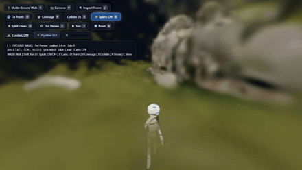
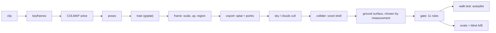
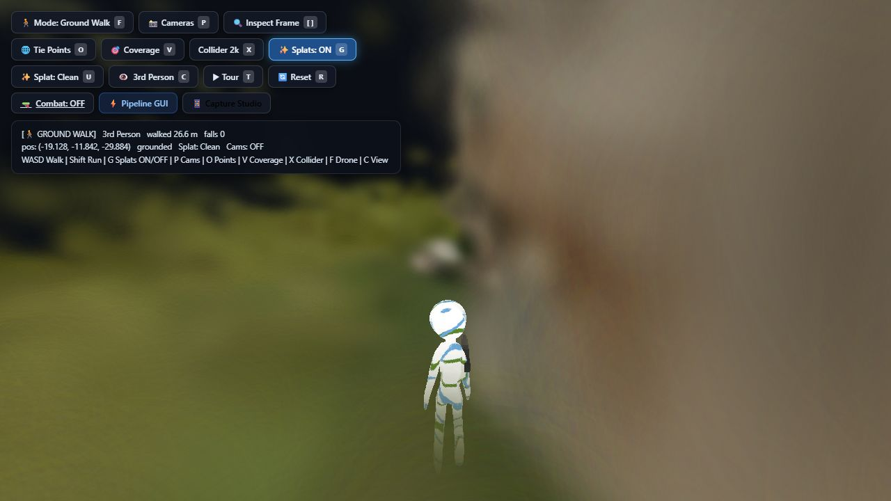
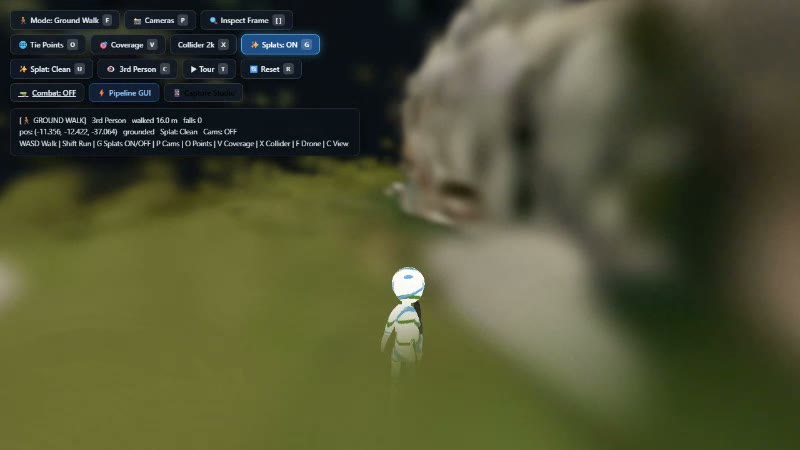

<h1 align="center">Video → walkable 3D world</h1>

<p align="center">
  <b>Point it at a drone or phone clip. Get back a world you can walk through in a
  browser — with a floor that holds you, walls that stop you, and a machine-verified
  proof that a character can actually get from A to B.</b>
</p>

<p align="center">
  <a href="https://www.youtube.com/watch?v=xMRw3slJjIo" title="Watch the full demo">
    
  </a>
</p>

<p align="center">
  <sub>The autopilot walking a world rebuilt from a single drone clip — no hand-tuned
  settings, and that HUD line is the harness's own telemetry, not a caption.<br>
  <b>▶ <a href="https://www.youtube.com/watch?v=xMRw3slJjIo">Watch the full demo</a></b>
  · <a href="#proof-not-promises">jump to the measured results</a></sub>
</p>

<p align="center">
  <a href="https://github.com/krisgarg25/Drone_Phone_video_to_playable_3d_world/actions/workflows/ci.yml"></a>
  <a href="LICENSE"></a>
  
  
  
  
</p>

This is a 3D Gaussian Splatting pipeline aimed at a different target than most of them:
not a nicer render, but a **place**. A splat cloud that looks perfect and has no floor, no
scale and no way in or out is a screensaver. The interesting, unsolved part is turning a
reconstruction into something a person can stand in and traverse — and that is where all
of the engineering below lives.

| | |
|---|---|
| **Input** | one `.mp4` (drone orbit, walked phone, handheld scan) or a folder of frames, optionally with recorded AR poses |
| **Output** | `work/<name>/viewer_assets/` — splat, collision mesh, heightfield, ground colours, generated tour route — served by a PlayCanvas viewer with a third-person character |
| **Verification** | an autopilot walk test that drives the character headless and logs a sampled trajectory, an 11-rule world gate, and blind A/B evidence against the real footage |
| **Manual tuning** | none. `--preset auto` diagnoses the footage, and every budget comes from the scene or the GPU |

---

## What's actually hard here

Four problems do most of the damage, and each one shaped part of this repo.

**1. A reconstruction has no metre.** Structure-from-motion recovers a scene up to an
unknown scale, so "how big is this room" is not answerable from geometry alone. The
pipeline measures it from physics instead: a drone flies ~5 m/s, a walked phone sits
~1.6 m above the ground, and the reconstructed camera path divided by either gives a ruler
(`--speed-anchor`, `--height-anchor`). Get this wrong and the collider voxel grid inflates
until the voxeliser crashes — which is exactly what it looked like when it did.

**2. Splats are not surfaces.** A Gaussian cloud has no floor to stand on. The collider is
built by voxelising the cloud into an axis-aligned shell — and that shell turns every
height change into a **vertical wall**. A capsule of radius 0.34 m cannot climb a 0.35 m
riser at all: it meets the flat face at its equator, so the contact normal is horizontal
and there is no lift. Walkability stops being a rendering question and becomes a routing
question about the body that will walk it.

**3. The truth depends on the machine.** Training sizes its pixel budget and gaussian cap
from the VRAM free *at that moment*, so the same clip yields 7.5k splats or 30k depending
on what else held the GPU. Every absolute threshold downstream of that fails
nondeterministically — which is most of what looked like "random crashes, then tweak the
settings". Anything read off a reconstruction is now judged relatively: share of the cloud,
spread across the camera path, the scene's own footprint.

**4. A number can be correct and the claim still wrong.** A walk test reporting
`walked 22 m, falls 0` sounds fine while the character floats. So the telemetry logs a
sampled route and the runner compares it against the distance claimed. That cross-check is
what caught the walker's ground probes casting a fixed 0.80–2.60 m band while the capsule
was scaled by `CHAR_SCALE`: in room-scale worlds the ray started *below its own floor*,
grounding never registered, and `falls=0` was vacuous because the fall detector needed
roughly eighty body heights to trip.

## How a video becomes a world



| stage | what it decides |
|---|---|
| **keyframes → COLMAP** | where every camera was. Flag support is probed from the vendored binary rather than assumed; a failing solve walks a rescue ladder (other matcher, other mapper, relaxed thresholds) before giving up, and a legacy-format vocab tree is reported as an unsupported asset instead of a crash |
| **train** | the splat, at a budget derived from free VRAM, checkpointing `splat.partial.ply` so a Windows-level kill that no `except` can catch is still rescuable |
| **frame** | the hardest step: which way is up, what metre the scene uses, how much of it is a room you can bound. If multi-view support is too thin it degrades to bounding the region by the flight path and the ground under it, and warns — it does not stop a run that already paid for training |
| **export → sky/clouds** | viewer assets, and for footage flown above a cloud layer, the fog that reconstructs as ~30% of the scene gets cut on painted-area fraction rather than a colour guess |
| **collider → surface** | the physics shell, then a *choice*: two candidate grounds are built (clipped shell vs heightfield), both are routed, and whichever the autopilot actually walks further on ships — so the physics mesh, the route and the underlay the browser draws cannot disagree |
| **gate** | 11 severity-tiered rules. Hard ones (no measured ground, inverted floor, spawn in mid-air) name themselves and are **never** downgraded to make a run green |
| **walk test** | drives the character headless through the real build, logging position, grounding and falls every 0.5 s |

## Proof, not promises

Measured on a 6 GB RTX 3050, every take in `videos/`, `--quality smoke` — a real 300-step
train, because skipping `train` leaves most of the graph unexercised and the run passes
vacuously:

| take | capture | status | steps | walked | sampled route | airborne | falls |
|---|---|---|---|---|---|---|---|
| rocks | drone orbit | complete | 17/17 | 65.2 m | 64.7 m | 5/61 | 0 |
| temple | drone, cloud sea | partial | 17/17 | 65.2 m | 64.0 m | 0/61 | 0 |
| room_w_jsonl | phone + AR poses | complete | 15/15 | 36.5 m | 31.7 m | 1/334 | 0 |
| roomscan | phone scan | complete | 15/15 | 17.1 m | 15.5 m | 0/331 | 0 |
| test1 | phone | complete | 15/15 | 28.0 m | 26.2 m | 0/332 | 0 |
| test2train | phone | complete | 15/15 | 28.1 m | 26.4 m | 0/336 | 0 |
| test2horizontal | phone, low texture | partial | 15/15 | 30.1 m | 28.0 m | 0/336 | 0 |

Walk telemetry moves a little between runs: the walk test is a live browser physics sim,
not a deterministic replay, so frame timing differs. `rocks` measured 5/61 airborne in the
matrix above and 8/60 in the clip further down — same world, same route, same result.

`partial` means the world shipped **and** the gate then refused to certify it: temple and
test2horizontal both fail the hard rule *spawn on supported ground*. The run says so on one
line rather than quietly passing a world it does not trust — both are coarse or mis-scaled
captures, and that is the honest answer about them.

Reproduce it:

```bash
.venv\Scripts\python tests\check_all.py    # fast suites, seconds — this is what CI runs
.venv\Scripts\python tests\test_e2e.py     # every take in videos/, ~30 min
```

`test_e2e.py` exits non-zero if any take produces no output, **or if there are no takes at
all** — "0/0 takes clean" is a green light for nothing, and it used to print exactly that.

### What the reconstruction actually looks like

Top is the real drone frame, bottom is the splat rendered from the same camera. These
stacks ship as blinded evidence with the A/B order kept in a separate key
(`results/pair_key_<take>.json`), so quality gets judged without anyone knowing which is
which:


And the same world from inside it, mid-walk. The HUD line is the walk test's own telemetry,
not a caption:



<details>
<summary><b>▶ The complete 34-second walk test, unedited</b> — one headless run, no cuts</summary>

<p align="center">
  <a href="https://raw.githubusercontent.com/krisgarg25/Drone_Phone_video_to_playable_3d_world/main/docs/media/walk-rocks.mp4">
    
  </a>
</p>

<p align="center"><sub><b>To watch it in place, use the
<a href="https://www.youtube.com/watch?v=xMRw3slJjIo">demo video</a>.</b> This frame links to
the raw clip, which downloads: GitHub serves repository files as
<code>application/octet-stream</code> and strips <code>&lt;video&gt;</code> from READMEs, so
the only thing that moves on this page without a click is the GIF at the top — that is why
the hero is a GIF.</sub></p>

The character is driven entirely by the tour route the pipeline generated for this world:
no keyboard, no hand-placed waypoints, and the `falls` counter is the viewer's own
collision check. It ends because the autopilot reported its route finished at 32 s — the
recorder kept running to 34 s.

</details>

Both are `--quality smoke`, i.e. the 300-step test train. `--quality high` is 1280 px,
15 000 steps and a 3 M gaussian cap.

## Install

| | |
|---|---|
| OS | **Windows 10/11** — COLMAP and ffmpeg are vendored as `.exe` |
| GPU | **Required.** NVIDIA, driver new enough for CUDA 12.4. `train` is not optional and gsplat has no CPU path |
| Python | **3.12** (pipeline) and **3.10** (training) |
| Node | 18+ — the collision mesh is built by `@playcanvas/splat-transform` |
| Disk | ~4 GB for both environments, ~1 GB per take while it works |
| Clone | `git-lfs` — one 313 MB COLMAP CUDA provider lives in LFS |

```bash
git clone https://github.com/krisgarg25/Drone_Phone_video_to_playable_3d_world.git
cd Drone_Phone_video_to_playable_3d_world
python scripts/bootstrap.py --with-train
```

`bootstrap.py` creates `.venv` and `.venv310`, installs the Node tools, downloads Chromium
for the walk test, and finishes by running `pipeline.py doctor`. Add `--check` to see what
it would do without doing it. Prefer the manual route: `requirements.txt` and
`requirements-train.txt` are pinned to exactly what the table above ran on, including the
gsplat CUDA wheel URL.

`doctor` is the check worth trusting — it runs every COLMAP subcommand this repo uses,
verifies `pycolmap` matches the vendored COLMAP version, probes the GPU and the Node CLI,
and prints a copy-pasteable `fix:` for anything it rejects. It also catches the nastiest
clone failure: a 313 MB LFS binary that arrived as a 130-byte text pointer, which COLMAP
otherwise reports as an unexplained stack buffer overrun.

## Run it

```bash
copy MyClip.mp4 videos\rocks.mp4                            # a clip, named after your take
.venv\Scripts\python pipeline.py run rocks                  # full quality, preset auto
.venv\Scripts\python pipeline.py run rocks --quality smoke  # every step, in minutes
.venv\Scripts\python pipeline.py view rocks                 # serve + open the viewer
```

| path | |
|---|---|
| `work/<name>/viewer_assets/` | the world — splat, collider, heightfield, route |
| `work/<name>/report.json` | per-step outcome, timing, which fallback fired and why |
| `work/<name>/walktest/` | frames, video, and `walk_log.json` with the sampled trajectory |
| `work/<name>/logs/` | one numbered log per step — the evidence behind the report |
| `results/blinded/` + `results/pair_key_<name>.json` | real-vs-render A/B stacks and their key |

Other commands: `scan` (diagnose footage, no reconstruction), `status`, `coverage`,
`capture` (what to film for a preset), `benchmark`, `ui` (dashboard), `doctor`.

## Filming that works

The reconstruction is only as good as the coverage, and this is the part no setting can
fix. `python pipeline.py capture room` prints the checklist for a preset; the short
version, learned from the takes above:

- **Overlap beats speed.** Slow the camera down. Motion blur is the most common cause of a
  sparse or failed solve, and the capture diagnostics report blur and ORB feature counts
  before anything expensive runs.
- **Textureless walls are the hard case.** A white room gives COLMAP almost nothing —
  `test2horizontal` is that take, and it is why the pipeline derives its region from the
  camera path when geometry support is thin instead of giving up.
- **Return to where you started.** A closed loop gives the solver loop closures; for drone
  work fly *through* the cloud layer rather than panning above it, or the fog reconstructs
  as 30% of your scene.
- **Record phone AR poses if you can.** `room_w_jsonl` carries them and is the most
  reliably-scaled indoor take here — see [docs/PHONE_CAPTURE.md](docs/PHONE_CAPTURE.md).

## Failure policy

The rule the repo is built around: **any video produces an output, and every failure names
itself.**

- **Classified, not tracebacked.** Every step failure gets a kind (`oom`,
  `voxel-overflow`, `unsupported-flag`, `unsupported-asset`, `empty-input`, `missing-tool`,
  `timeout`, `crash`). Retryable ones are repaired — OOM halves the pixel budget, voxel
  overflow climbs the voxel ladder — and the repair is recorded in the report.
- **Derived, not tuned.** No per-scene magic numbers; a new constant has to argue why it
  cannot be measured.
- **Degrade, don't discard.** A locked screenshot costs one screenshot, not the run. An
  evidence step that can produce nothing exits 0 and the matrix reports `evidence missing:`
  — the world still ships.
- **The gate does not move.** Hard verdicts are never downgraded for a green run, and
  telemetry is allowed to contradict the headline number.
- **Stale caches cannot hide a fix.** Each step marker stores a hash of the code that ran,
  so editing a step invalidates exactly that step and everything downstream of it.

## Layout

```
pipeline.py            runner: step graph, budgets, retries, report, viewer
scripts/               one script per step + shared hardening in robust.py
viewer/                PlayCanvas walkable viewer (pc.js) + phone capture page
tools/                 vendored COLMAP, ffmpeg, vocab tree, splat-transform, navbake
tests/                 check_all.py (fast suites), test_e2e.py (every take)
docs/                  capture technique and phone AR notes
work/<name>/           per-take output — regenerable, gitignored
README-MVP.md          the engineering log: every step, every measured number, and every
                       defect this project found by measuring instead of reading
```

`README-MVP.md` is the long form — per-step design, the collider walkability analysis, and
the before/after for each fix. This page is the door.

## Troubleshooting

| symptom | cause and fix |
|---|---|
| COLMAP dies with `stack buffer overrun` / `0xC0000409` | A git-lfs file arrived as a 130-byte pointer. `git lfs install && git lfs pull` — `bootstrap.py --check` says so in one line |
| `vocab_tree_matcher` fails the same way | The vendored `tools/vocab_tree.bin` is a legacy flann index this COLMAP 4.x refuses to read. Loop closure is skipped and the solve still completes; re-download the faiss build from https://demuc.de/colmap/vocab_tree_flickr100K_words32K.bin to get it back |
| `'C:\Users\you\Desktop\Drone' is not recognized` | The repo root has spaces. Nothing here may use `shell=True`; if you hit this it is a bug — `scripts/robust.py:run_cmd` refuses both forms on purpose |
| `splat-transform is not installed` | The collider names this instead of raising `[WinError 2]`: `cd tools && npm install`, or re-run `bootstrap.py`. `npx` cannot be a fallback — npm's `npx` is a `.cmd` shim `subprocess` will not start without a shell |
| Walk test reports `connection refused` on 8137 | A stale `_serve.py` holds it, or none does. The runner starts its own and reuses a live one; `netstat -ano \| findstr 8137` shows who owns it |
| `train` says no CUDA | `.venv310` missing, or torch can't see the GPU — `bootstrap.py --with-train`, then `pipeline.py doctor` |
| A take builds a world but the gate fails it | Read `work/<name>/world_check.json`; it names the rule. Two takes here fail *spawn on supported ground* today, and that is reported rather than hidden |
| Nothing in `videos/` | Clips are gitignored at 86 MB each; the per-take `calibration.json` / `data_poses.jsonl` fixtures deliberately are not, so a clone gets pose data and no footage |

## Known limits

Read these before judging a result — they are honest edges, not setup bugs:

- **The table above is `--quality smoke`.** That proves nothing fails; it is not a claim
  about final visual quality. Judge that from `results/blinded/`.
- **Indoor phone takes walk 15–36 m, not 65 m.** Rooms reconstruct small and coverage is
  thin; several sit close to the scale ambiguity in point 1.
- **Clone weight.** ~0.71 GB of history, three files within 2 MB of GitHub's 100 MB-per-file
  limit, and 313 MB in LFS, which costs bandwidth on every clone. The source alone is ~26
  MB; a `git filter-repo` history rewrite is the only real cure.
- **`tools/gsplat` and `tools/pc-engine` are submodules** needed only to read or patch those
  projects — the pipeline uses the installed gsplat wheel and the vendored viewer scripts.
- **Windows only today.** COLMAP and ffmpeg are vendored as `.exe`; Linux means swapping
  those and re-testing the walk viewer.

## License and credits

MIT — see [LICENSE](LICENSE). Vendored components keep their own terms: COLMAP
(BSD-3-Clause), ffmpeg (LGPL/GPL as built), PlayCanvas (MIT),
[`@playcanvas/splat-transform`](https://github.com/playcanvas/splat-transform) (MIT), and
[gsplat](https://github.com/nerfstudio-project/gsplat) (Apache-2.0) for the differentiable
rasteriser this pipeline trains on.
