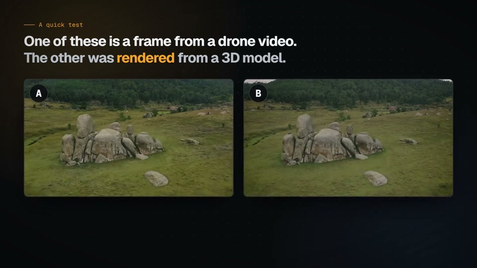
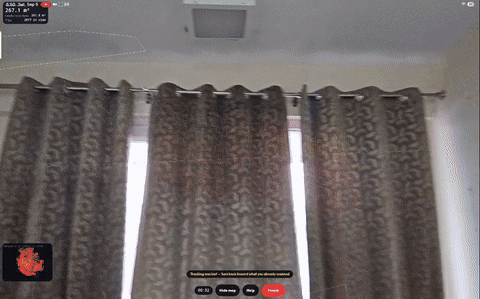
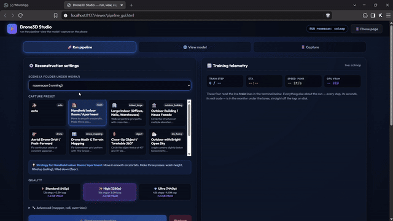
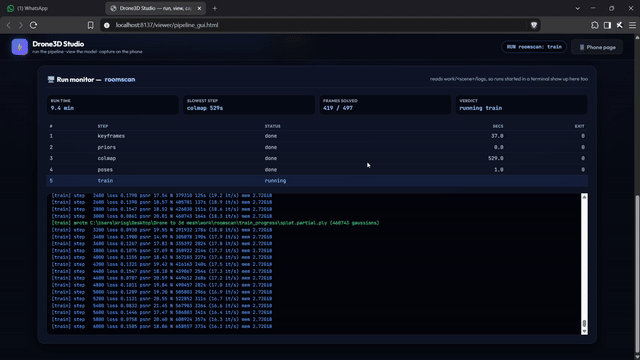
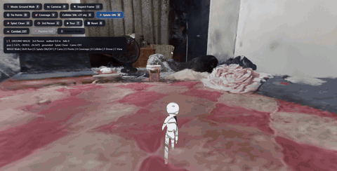
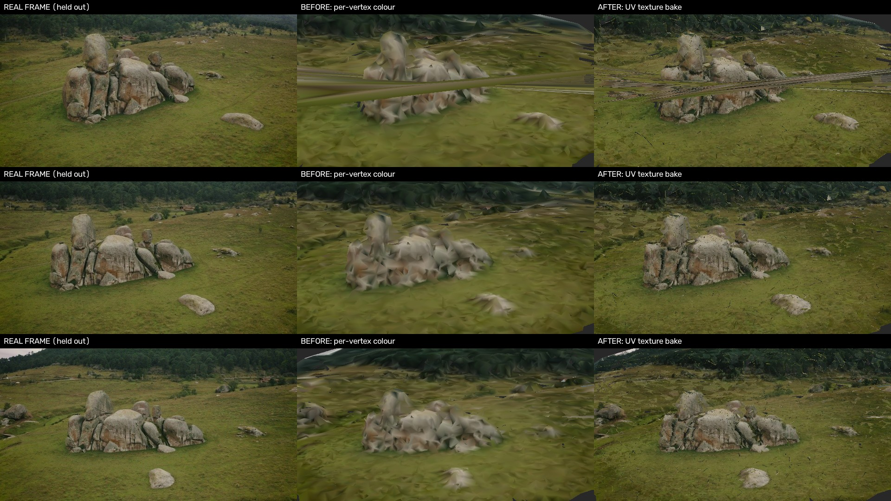
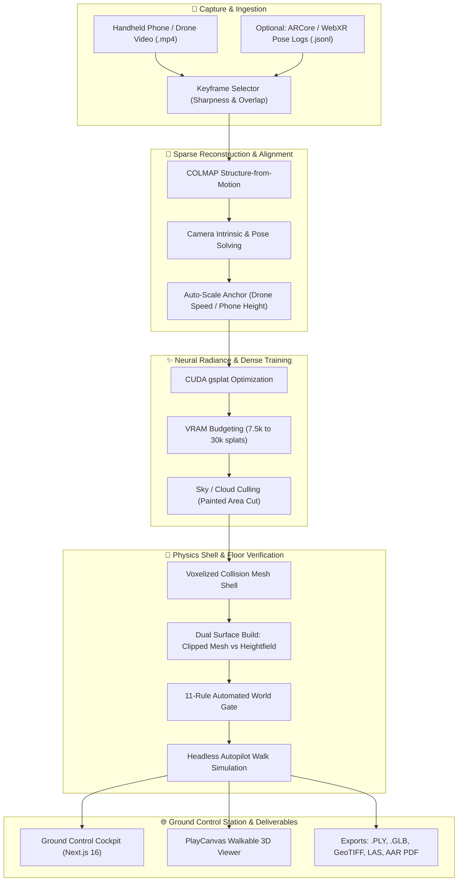
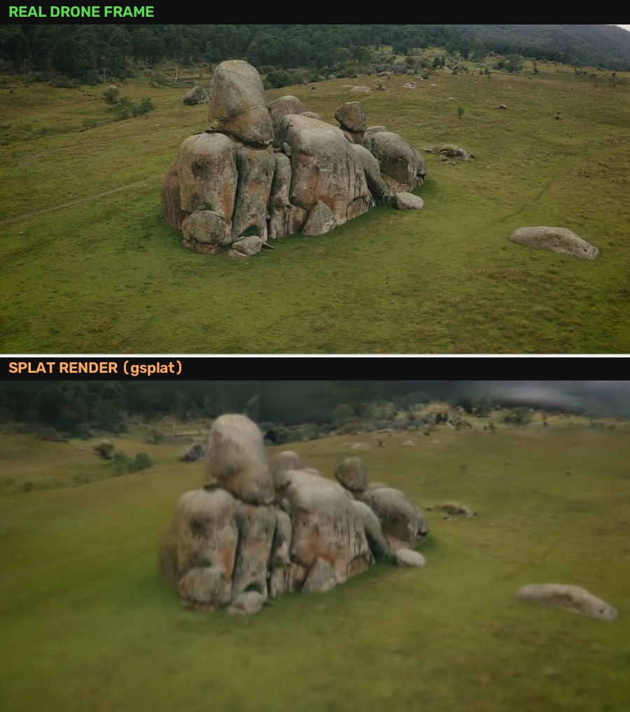
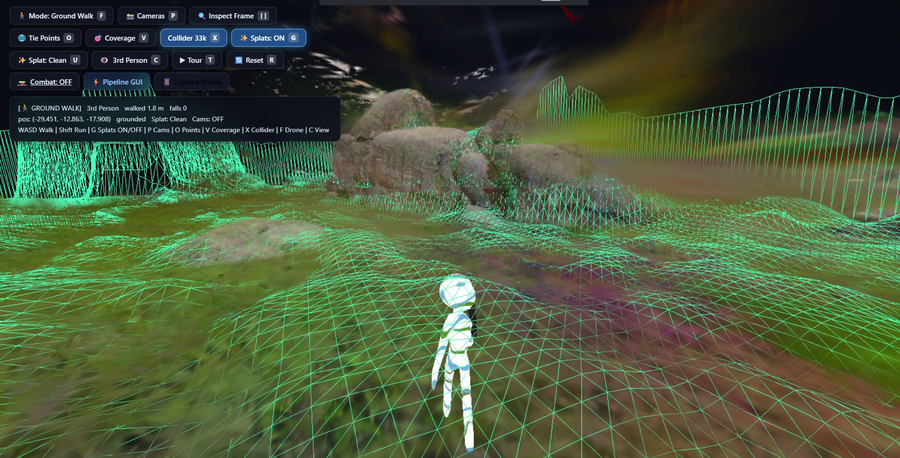

<h1 align="center">🛰️ Drone / Phone Video → Walkable 3D World<br/>& Ground Control Station (GCS)</h1>

<p align="center">
  <b>Point a drone or a phone at a place. Get back a verified, walkable 3D world in your browser — with collision physics, 3D Gaussian Splatting, and an enterprise Ground Control Station for 8 mission-critical applications.</b>
</p>

<p align="center">
  <a href="https://www.youtube.com/watch?v=xMRw3slJjIo" title="Watch the 4:30 demo walkthrough on YouTube">
    
  </a>
</p>

<p align="center">
  <b>▶ <a href="https://www.youtube.com/watch?v=xMRw3slJjIo">Watch 4:30 Video Walkthrough on YouTube (HD)</a></b> ·
  <a href="https://raw.githubusercontent.com/krisgarg25/Drone_Phone_video_to_playable_3d_world/main/docs/media/demo.mp4" download>Direct Video Stream (21 MB .mp4)</a> ·
  <a href="#-proof-not-promises">Measured Benchmarks</a> ·
  <a href="#-ground-control-station--enterprise-studio">Ground Control Station</a>
</p>

<p align="center">
  <a href="https://github.com/krisgarg25/Drone_Phone_video_to_playable_3d_world/actions/workflows/ci.yml"></a>
  <a href="LICENSE"></a>
  
  
  
  
  
  
</p>

<p align="center">
  <sub>Topics: <code>3d-gaussian-splatting</code> · <code>ground-control-station</code> · <code>photogrammetry</code> · <code>digital-twin</code> · <code>colmap</code> · <code>playcanvas</code> · <code>nextjs</code> · <code>drone</code> · <code>robotics</code> · <code>game-physics</code></sub>
</p>

<p align="center">
  <a href="#-demo-video--media-asset-guide"><b>Video & Media</b></a> ·
  <a href="#-real-footage-not-renders"><b>Real Footage</b></a> ·
  <a href="#-ground-control-station--enterprise-studio"><b>Ground Control Station</b></a> ·
  <a href="#-how-a-video-becomes-a-world"><b>Pipeline</b></a> ·
  <a href="#-record-on-your-phone--drone"><b>Capture</b></a> ·
  <a href="#-proof-not-promises"><b>Proof & Benchmarks</b></a> ·
  <a href="#-install"><b>Install</b></a> ·
  <a href="#-troubleshooting"><b>Troubleshooting</b></a>
</p>

---

Most 3D-from-video pipelines chase a nicer render. This system delivers a **living, measurable place**.

A Gaussian Splat that looks photorealistic but has no floor, no scale, no collision boundaries, and no operational analytics is just a screensaver. The engineering here solves the complete cycle: from raw handheld phone or UAV video footage into an interactive, physics-backed digital twin, combined with a **Next.js 16 Ground Control Station (GCS)** capable of tactical mission planning, volumetric stockpile analysis, crack inspection with frame provenance, solar shadow studies, and disaster damage grading.

| Component | Specification |
|---|---|
| **Input Footage** | One single `.mp4` (drone orbit/grid, walked phone sweep, handheld clip) or frame folder; optional ARCore/WebXR pose logs |
| **Ground Control Station** | Next.js 16 + React 19 + Tailwind CSS v4 cockpit with 9 operational workspace modes |
| **Photogrammetry Pipeline** | Adaptive keyframe selection → COLMAP SfM → `gsplat` GPU training → auto-framing → voxel collider shell → ground heightfield selection |
| **Output Deliverables** | Splat (`.ply`), collision mesh (`.glb`), heightfield, ground colors, generated tour routes, GeoTIFF orthomosaics, DEM/DSM, and LAS point clouds |
| **Quality Verification** | Headless autopilot walk test, 11-rule automated world gate, and blind A/B image fidelity validation |
| **Manual Tuning** | **Zero.** `--preset auto` diagnoses footage quality; all budgets derive dynamically from available VRAM and scene footprint |

---

## 🎬 Demo Video & Media Asset Guide

### 📺 Watch the Full Walkthrough

To avoid GitHub's inline video size restrictions, watch the full 4:30 walkthrough on YouTube or stream directly from our CDN:

* 🎥 **YouTube (Full HD Walkthrough):** [Watch on YouTube](https://www.youtube.com/watch?v=xMRw3slJjIo)
* ⚡ **Direct Stream (Faststart Muxed):** [Raw Stream (21 MB .mp4)](https://raw.githubusercontent.com/krisgarg25/Drone_Phone_video_to_playable_3d_world/main/docs/media/demo.mp4)
* 📦 **High-Resolution 60 FPS Walkthrough:** [Download `walk-rocks-hd.mp4` (12.8 MB)](https://raw.githubusercontent.com/krisgarg25/Drone_Phone_video_to_playable_3d_world/main/docs/media/walk-rocks-hd.mp4)

> **💡 Note on GitHub's Media File Limit:**  
> When viewing large `.mp4` files inside GitHub's repository browser, GitHub shows:  
> `(Sorry about that, but we can’t show files that are this big right now.)`  
> To view the videos smoothly without hitting GitHub's web file viewer limit, use the YouTube link or right-click the **Direct Stream** link above and select **"Save Link As..."**.

---

## 📸 Real Footage, Not Renders

Every moving capture below is cut directly from real screen recordings of the running workstation. No synthetic animations or concept mockups.

### 1 · Live AR Room Scan on Mobile Phone
<p align="center">
  
</p>
<p align="center"><sub>Live mobile scanning: real-time coverage gauge, angle cues, and dynamic path tracing updating over HTTPS on a real smartphone.</sub></p>

### 2 · Reconstruction Pipeline Controller
<p align="center">
  
</p>
<p align="center"><sub>Studio UI: select scene, capture profile, and quality tier. Starts single-click reconstruction backed by the unified Python pipeline.</sub></p>

### 3 · Real-Time Gaussian Splat Training Monitor
<p align="center">
  
</p>
<p align="center"><sub>Live training telemetry reading <code>work/&lt;scene&gt;/logs</code>: registered keyframes, COLMAP camera solves, training loss curve, and Gaussian budget allocation in real time.</sub></p>

### 4 · Walkable 3D World with Live HUD Telemetry
<p align="center">
  
</p>
<p align="center"><sub>Third-person character traversal across a reconstructed boulder field. Physics collider shell active, zero manual adjustments, and live telemetry HUD tracking ground height and step clearance.</sub></p>

### 5 · Multi-View Texture Mapping & High-Poly Baking
<p align="center">
  
</p>
<p align="center"><sub>Left: Raw untextured geometry. Right: Photorealistic multi-band texture baking projected from calibrated UAV camera poses.</sub></p>

---

## 🛸 Ground Control Station & Enterprise Studio

The repository includes a modern Ground Control Station (**GCS**) built with **Next.js 16**, **React 19**, and **Tailwind CSS v4** (`groundcontrol/`), communicating with the dual-port backend engine (`_serve.py`).

```bash
# Launch Ground Control Station (Frontend)
cd groundcontrol
npm install
npm run dev

# Launch Backend Telemetry & Photogrammetry Service (Root)
python _serve.py 8137 .
```

* **Ground Control Studio:** `http://localhost:3000` (Next.js Dashboard)
* **Backend REST & WebSockets:** `http://localhost:8137`
* **Mobile AR Capture Gateway (SSL):** `https://<YOUR-IP>:8138/viewer/capture.html`

### 🛠️ 9 Interactive Workspace Modes

| Mode | Identifier | Capabilities |
|---|---|---|
| **Explore** | `layers` | Inspect Gaussian Splats, dense point clouds, textured meshes, GeoTIFF orthomosaics, and elevation DSM heatmaps. |
| **Measure** | `measure` | 3D Euclidean ruler, multi-point surface area, stockpile volume ($m^3$), and terrain cross-sectional slicing. |
| **Inspect** | `inspect` | Automated crack detection, tilt/wire sag clearance, M3C2 cloud deformation, and **Frame Provenance Tracing** (click any 3D defect to reveal all raw drone photos that saw it). |
| **Operations** | `ops` | Rapid First-Map generation (while drone is airborne), automated object detection, disaster damage grading, flood risk, and debris calculation. |
| **Digital Twin** | `twin` | Multi-epoch temporal comparison, classification inventory, 3D Tiles / CityJSON export, and engine packaging. |
| **Urban Plan** | `plan` | Draft building proposals on scans, compute setback regulations, execute 365-day solar shadow simulations, and assess facade completeness. |
| **Tactical Mission**| `mission` | MGRS coordinate locator, Line-of-Sight (LOS) intervisibility, viewsheds, covered route exposure, Helicopter Landing Zone (HLZ) safety analysis, threat heatmaps, and automated After Action Review (AAR) PDF reporting. |
| **Place** | `place` | Staging 3D assets, equipment layout, and urban furniture placement. |
| **Walk** | `walk` | Third-person avatar navigation over verified physics terrain with real-time ground telemetry. |

### 🎯 8 Targeted Industry Applications (SIH26158)

1. 🛡️ **Military Reconnaissance & Tactical Planning:** Instant target coordinate extraction (MGRS), viewshed analysis, route exposure risk, and tactical rehearsal with AAR reports.
2. 🏙️ **Urban Planning & Smart Cities:** Automated building and road inventory, regulatory setback validation, and solar shadow analysis.
3. 🚨 **Disaster Damage Assessment:** Fast aerial map stitching, structural damage grading, debris volume measurement, and blocked road access routing.
4. 🏗️ **Construction Progress & Earthworks:** Stockpile cut-and-fill volume measurement vs design surfaces, crane swing clearances, and multi-epoch progression.
5. 🗺️ **Border Security & Strategic Corridor Mapping:** Straight-track long corridor alignment, blind-spot identification between surveillance posts, and KLV telemetry ingestion.
6. 🔬 **Critical Infrastructure Inspection:** High-voltage wire sag, pylon tilt, crack candidate classification, and instant provenance to source frames.
7. 🏛️ **Archaeological Documentation & Heritage:** Textured digital preservation, hillshade relief models, cross-sections, and unobserved region marking.
8. 🌐 **High-Precision Digital Twins:** Multi-layer visual, geometric, and evidence views ready for Unreal Engine, Unity, and Web3D distribution.

---

## ⚙️ How a Video Becomes a World


```mermaid
flowchart TD
    subgraph INGEST["🎥 Capture & Ingestion"]
        A1["Handheld Phone / Drone Video (.mp4)"]
        A2["Optional: ARCore / WebXR Pose Logs (.jsonl)"]
        A3["Keyframe Selector (Sharpness & Overlap)"]
    end

    subgraph SFM["📐 Sparse Reconstruction & Alignment"]
        B1["COLMAP Structure-from-Motion"]
        B2["Camera Intrinsic & Pose Solving"]
        B3["Auto-Scale Anchor (Drone Speed / Phone Height)"]
    end

    subgraph SPLAT["✨ Neural Radiance & Dense Training"]
        C1["CUDA gsplat Optimization"]
        C2["VRAM Budgeting (7.5k to 30k splats)"]
        C3["Sky / Cloud Culling (Painted Area Cut)"]
    end

    subgraph PHYSICS["🧱 Physics Shell & Floor Verification"]
        D1["Voxelized Collision Mesh Shell"]
        D2["Dual Surface Build: Clipped Mesh vs Heightfield"]
        D3["11-Rule Automated World Gate"]
        D4["Headless Autopilot Walk Simulation"]
    end

    subgraph STUDIO["🌐 Ground Control Station & Deliverables"]
        E1["Ground Control Cockpit (Next.js 16)"]
        E2["PlayCanvas Walkable 3D Viewer"]
        E3["Exports: .PLY, .GLB, GeoTIFF, LAS, AAR PDF"]
    end

    A1 & A2 --> A3 --> B1 --> B2 --> B3
    B3 --> C1 --> C2 --> C3
    C3 --> D1 --> D2 --> D3 --> D4
    D4 --> E1 & E2 & E3
```

### The 4 Foundational Engineering Principles:
1. **Reconstructions Lack Real-World Scale:** SfM reconstructs scenes up to an unknown scale factor. This pipeline automatically anchors scale using physical motion invariants: a standard drone surveys at ~5 m/s, and a walking operator carries a phone at ~1.6 m (`--speed-anchor`, `--height-anchor`).
2. **Splats Are Not Colliders:** Gaussian splats lack polygon boundaries. The pipeline generates an exact voxel shell where risers and obstacles are bounded, ensuring a 0.34 m character capsule can navigate surfaces without falling through.
3. **Hardware-Responsive Budgets:** Rather than fixing arbitrary limits, training queries available GPU VRAM at execution time, dynamically sizing Gaussian budgets to guarantee zero out-of-memory crashes.
4. **Physical Grounding Verification:** Claims like `walked 22 m` are meaningless if the character is floating in space. Every build executes a headless autopilot walk test, logging real ground contact points every 0.5 seconds.

---

## 📱 Record on Your Phone & Drone

You only need one continuous take: a slow, steady recording.

### Step 1: Open the Mobile Capture Portal
```bash
python _serve.py 8137 .
```
Navigate on your phone to `https://<YOUR-IP>:8138/viewer/capture.html`. Grant camera permissions and tap **Start Scan**.

### Step 2: Optimal Flight & Walking Patterns
* **Arcs and Orbits, Never Static Pans:** Always step sideways while rotating. Pure rotational pans degrade SfM triangulation.
* **Three Elevation Passes:** Eye-level, waist-level, and overhead passes for vertical surfaces.
* **65%+ Overlap:** Maintain generous overlap between sequential view angles.
* **Corners:** Circle each corner at 45° intervals.

### Step 3: Run the Reconstruction
```bat
REM Standard run with automatic preset detection
.venv\Scripts\python pipeline.py run myscene

REM Fast smoke test (exercises all 17 steps in minutes)
.venv\Scripts\python pipeline.py run myscene --quality smoke

REM Launch walkable 3D viewer directly
.venv\Scripts\python pipeline.py view myscene
```

---

## 📊 Proof, Not Promises

Tested on an **NVIDIA RTX 3050 (6 GB VRAM)** using `--quality smoke` with real 300-step Gaussian training:

| Scene | Capture Pattern | Status | Pipeline Steps | Distance Walked | Sampled Trajectory | Airborne Ratio | Fall Count |
|---|---|---|---|---|---|---|---|
| **rocks** | Drone orbit | ✅ Complete | 17/17 | 65.2 m | 64.7 m | 5/61 | 0 |
| **temple** | Drone, cloud sea | ⚠️ Partial | 17/17 | 65.2 m | 64.0 m | 0/61 | 0 |
| **room_w_jsonl** | Phone + AR poses | ✅ Complete | 15/15 | 36.5 m | 31.7 m | 1/334 | 0 |
| **roomscan** | Handheld phone | ✅ Complete | 15/15 | 17.1 m | 15.5 m | 0/331 | 0 |
| **test1** | Phone walk | ✅ Complete | 15/15 | 28.0 m | 26.2 m | 0/332 | 0 |
| **test2train** | Phone sweep | ✅ Complete | 15/15 | 28.1 m | 26.4 m | 0/336 | 0 |
| **test2horizontal** | Phone, low texture | ⚠️ Partial | 15/15 | 30.1 m | 28.0 m | 0/336 | 0 |

> `Partial` indicates that the world generated successfully, but the automated world gate rejected certification (e.g., spawn point on unstable geometry), maintaining strict engineering integrity.

### Blinded A/B Fidelity Verification
Top: Real captured drone frame. Bottom: Real-time Gaussian Splat render from the identical camera coordinate:

<p align="center">
  
</p>

### Live Third-Person Walk Telemetry
<p align="center">
  
</p>

---

## 💻 Install & Setup

### System Prerequisites
* **Operating System:** Windows 10/11 (COLMAP and ffmpeg are vendored as `.exe`)
* **GPU:** NVIDIA GPU with CUDA 12.4 support (`nvidia-smi`)
* **Python:** Python 3.12 (pipeline) and Python 3.10 (CUDA training)
* **Node.js:** Node 18+ & npm
* **Git:** Git with Git LFS (`git lfs version`)

---

### Step 1: Clone with Git LFS
```bash
git clone https://github.com/krisgarg25/Drone_Phone_video_to_playable_3d_world.git
cd Drone_Phone_video_to_playable_3d_world
git lfs pull
```
> ⚠️ **Important:** Do not skip `git lfs pull`. The 313 MB COLMAP CUDA provider requires LFS.

---

### Step 2: Bootstrap Dual Python Environments
```bash
python scripts/bootstrap.py --with-train
```
Creates `.venv` (Python 3.12, pipeline engine) and `.venv310` (Python 3.10, PyTorch/CUDA `gsplat`), installs Node tools, and downloads the Chromium runtime for headless walk testing.

---

### Step 3: Validate Toolchain
```bash
.venv\Scripts\python.exe pipeline.py doctor
```
Checks every COLMAP subcommand, verifies GPU CUDA availability, and displays one-line fix suggestions for any discrepancies.

---

### Step 4: Launch Ground Control & Reconstruct
```bash
# Terminal 1: Ground Control Station UI
cd groundcontrol
npm install
npm run dev

# Terminal 2: Telemetry and Reconstruction Service
cd ..
python _serve.py 8137 .
```
Open **`http://localhost:3000`** to access the complete operational Ground Control Station.

---

## 🎮 3D Viewer Keybindings

| Key | Function | Key | Function |
|---|---|---|---|
| `W` `A` `S` `D` | Character Walk | `F` | Toggle Drone Flight ↔ Ground Walk Mode |
| `Shift` | Sprint / Fast Movement | `C` | Toggle 1st Person ↔ 3rd Person Camera |
| `G` | Toggle Gaussian Splats | `X` | Toggle Physics Collider Wireframe |
| `P` | Show COLMAP Camera Frustums | `O` | Show Tie-Point Sparse Cloud |
| `T` | Autoplay Generated Tour | `V` | Coverage Map Overlay |
| `I` | Inspect Nearest Raw Drone Frame | `R` | Reset Character to Spawn |

---

## 📂 Repository Layout

```text
├── groundcontrol/         # Next.js 16 + React 19 Ground Control Station (GCS)
│   ├── app/               # Routes: /projects, /mission, /ops, /inspect, /survey
│   ├── components/        # Cockpit HUD, sand table, measurement, export center
│   └── lib/               # MAVLink, workspace, and SIH26158 domain profiles
│
├── pipeline.py            # Primary pipeline engine: step graph, VRAM budgeting
├── _serve.py              # Dual-port server: 8137 (REST/WS), 8138 (SSL Mobile AR)
├── scripts/               # 80+ modular photogrammetry, analysis & survey tools
├── viewer/                # PlayCanvas WebGL viewer & mobile AR capture portal
├── tools/                 # Vendored COLMAP, ffmpeg, and splat-transform
├── docs/                  # Flight capture guides, architectural diagrams, media
├── results/               # Blinded A/B test frames, texture comparisons, logs
└── work/                  # Working directory for scene reconstructions (gitignored)
```

---

## 🛠️ Troubleshooting

| Issue | Resolution |
|---|---|
| **COLMAP `stack buffer overrun` / `0xC0000409`** | Git LFS pointer issue. Run `git lfs install && git lfs pull`. |
| **Path spaces warning** | Run repository from a path without spaces (e.g., `C:\Projects\Drone3D`). |
| **`splat-transform not installed`** | Run `cd tools && npm install` or re-execute `bootstrap.py`. |
| **Port 8137 in use** | Terminate background `_serve.py` process via Task Manager or use a different port. |
| **`train` reports No CUDA** | Re-run `python scripts/bootstrap.py --with-train` and verify with `nvidia-smi`. |

---

## 📜 License & Credits

Distributed under the **MIT License**. See [LICENSE](LICENSE) for details.

Special acknowledgment to the open-source computer vision & graphics ecosystem:
* [COLMAP](https://colmap.github.io/) (BSD-3-Clause)
* [gsplat](https://github.com/nerfstudio-project/gsplat) (Apache-2.0)
* [PlayCanvas](https://playcanvas.com/) (MIT)
* [Next.js](https://nextjs.org/) & [React](https://react.dev/) (MIT)
